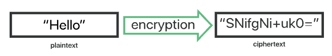

# Cryptography

Encryption is a way of encoding data so that only authorized parties can understand the information. In technical terms, it is the process of converting human-readable plain text into incomprehensible text, also known as ciphertext. In simpler terms, encryption takes readable data and alters it to make it appear random.




****Cryptography Key****

A cryptography key is a string of characters used within cryptographic algorithms to perform various operations like encryption, decryption, authentication, and more. It functions like a physical key, locking and unlocking data. Keys alter data to appear random, making it challenging for unauthorized entities to interpret.

**Brute force attack**

A brute force attack is when an attacker who does not know the decryption key tries to determine the key by making millions or billions of guesses. Brute force attacks are much faster with modern computers, so the encryption has to be extremely strong and complex.

**Collision Attack**

A collision attack occurs when two different inputs produce the same hash output. Add preffix/suffix to avoid that if are the same for two inputs

**Padding**

Each algorithm has its own padding scheme, which states which values to put in place of the missing bits in a block.

**Digital signature**

Digital signature encryption involves the use of asymmetric cryptography to validate and secure messages. The process includes generating a unique hash of the message or document and encrypting it with the sender's private key, which can be verified using the sender's public key.

# Secret-Key Encryption

**Symmetric Key Cryptography:** Uses a single shared key for both encryption and decryption


There are two types of symmetric key algorithms:

- **Block cipher:** In a block cipher, the cipher algorithm works on a fixed-size block of data. For example, if the block size is eight, eight bytes of plaintext are encrypted at a time. Normally, the user’s interface to the encrypt/decrypt operation handles data longer than the block size by repeatedly calling the low-level cipher function.
- **Stream cipher:** are cryptographic algorithms that encrypt plaintext one bit or byte at a time, using a continuous stream of keys generated in real-time. Basically, a stream cipher generates a keystream based on the provided key. The generated keystream is then XORed with the plaintext data.

Some examples of symmetrical cryptography include the following:

- **AES:** (Advanced Encryption Standard) is a symmetric-key encryption algorithm used for securing sensitive data. It operates on fixed-size blocks and supports key sizes of 128, 192, or 256 bits.
    
    AES in CBC (Cipher Block Chaining) mode combines each plaintext block with the previous ciphertext block before encryption, enhancing security
    
- **DES:** (Data Encryption Standard) is a symmetric-key block cipher with a 56-bit key length, susceptible to vulnerabilities due to its small key size. DES operates on 64-bit blocks and applies 16 rounds of substitution and permutation, eventually generating ciphertext.
    
    Compared to AES, DES is less secure
    
- **3 DES:** is an encryption technique that applies the Data Encryption Standard (DES) cipher algorithm three times consecutively to increase security.
    
    It uses a 56-bit key size like DES, but by performing encryption three times (encrypt-decrypt-encrypt), it effectively provides a key length of 168 bits, enhancing security compared to DES
    
- **Blowfish:** its flexibility in handling various key lengths (32 bits to 448 bits) and block sizes (32 bits to 64 bits)
    
    Blowfish employs a key-expansion process and generates subkeys from the original key using a complex key schedule
    

**Examples**

```python
# Encrypts using AES in CBC (Cipher Block Chaining) mode

!pip install pycryptodome

from Crypto.Util.Padding import pad, unpad
from Crypto.Cipher import AES

BLOCK_SIZE = 64

# message to encrypt
message = b"Hi, this is a secret message."
key = b'This is a key...'

encryption_suite = AES.new(key, AES.MODE_CBC, b'This is an IV...')
cipher_text = encryption_suite.encrypt(pad(message, BLOCK_SIZE))
print(len(cipher_text))

decryption_suite = AES.new(key, AES.MODE_CBC, b'This is an IV...')
decrypted = unpad(decryption_suite.decrypt(cipher_text), BLOCK_SIZE)

print(decrypted)

# Output
# 64
# b'Hi, this is a secret message.'
```

```python
# Symmetric Encryption (Fernet):

from cryptography.fernet import Fernet

# Generate the key
key = Fernet.generate_key()

# Create an encryption object with the key
cipher = Fernet(key)

# Message to encrypt
message = b"Hi, this is a secret message."

# Encrypt the message
encrypted_message = cipher.encrypt(message)

print("Original message:", message)
print("Encrypted message:", encrypted_message)

# Decrypt the message
decrypted_message = cipher.decrypt(encrypted_message)

print("Decrypted message:", decrypted_message)

# Output
# Original message: b'Hi, this is a secret message.'
# Encrypted message: b'gAAAAABljEz0iJCEFHT7s16_fmzKijxVwav3lYFt5pDb4lPJKTOOns-xqXBEJ-R4vZ_KKzn60l1_VzMKrRvmqkHM-RAIuzgoFwqwgtS99sipeWAcrPKjGkA='
# Decrypted message: b'Hi, this is a secret message.'
```

```python
# Stream Encryption (XOR):
# Function to encrypt/decrypt using XOR.
def xor_encrypt_decrypt(message, key):
    encrypted = bytearray()
    for i in range(len(message)):
        encrypted.append(message[i] ^ key[i % len(key)])
    return encrypted

# message to encrypt
message = b"Hi, this is a secret message."

# Key to XOR
key = b"key"

# Encrypt the message using XOR
encrypted_message = xor_encrypt_decrypt(message, key)

print("Original message:", message)
print("Encrypted message using XOR:", encrypted_message)

# decrypt the message using XOR
decrypted_message = xor_encrypt_decrypt(encrypted_message, key)

print("Decrypted message with XOR:", decrypted_message)

# Output
# Original message: b'Hi, this is a secret message.'
# Encrypted message using XOR: bytearray(b'#\x0cUK\x11\x11\x02\x16Y\x02\x16Y\nE\n\x0e\x06\x0b\x0e\x11Y\x06\x00\n\x18\x04\x1e\x0eK')
# Decrypted message with XOR: bytearray(b'Hi, this is a secret message.')
```

# One-Way Hash Function

**Hash Functions:** Converts input data into a fixed-size string, generating a unique hash value, commonly used for data integrity verification. There is no usage of any key in this algorithm. A hash value with fixed length is calculated as per the plain text which makes it impossible for contents of plain text to be recovered. Many operating systems use hash functions to encrypt passwords.

**MD5**

Message Digest Algorithm 5 (MD5) is a widely used cryptographic hash function designed by Ronald Rivest in 1991. It generates a fixed-size 128-bit hash value from an input message of any length. MD5 is one of the earlier hash functions and was initially developed to verify data integrity and ensure message authenticity.

The following statements are true of a good hash function:

- **Collision resistant:** If any portion of the data is modified, a different hash will be generated, ensuring data integrity.
- **One-way:** The function is irreversible. That is, given a digest, it is not possible to find the data that produces it, ensuring data securtity.

**Examples**

```python
# Hashing (SHA-256):

import hashlib

# Message to hash
message = b"Hi, this is a secret message."

# Create a hash object using SHA-256.
hash_object = hashlib.sha256()

# Update the hash with the message
hash_object.update(message)

# Get hash digest
hash_result = hash_object.digest()

print("Original message:", message)
print("Hash SHA-256:", hash_result)

# Output
# Original message: b'Hi, this is a secret message.'
# Hash SHA-256: b'\xc1\xed\xde?,\xf4W\xf0CK>h\x9f\n\xb7\x11\x14\x03\x83\x93H\x1c"L\xfb\xffm\xfd\xf7\x1b-l'
```

# Public Key Cryptography

**Asymmetric Key Cryptography:** Utilizes a pair of keys - public and private - for encryption and decryption, enhancing security.


Some examples of asymmetrical cryptography include the following:

- **RSA:** RSA encryption can also be used in the reverse arrangement, where the private key encrypts the data and the public key decrypts it. This method is used to confirm the authenticity of the sender rather than to hide information.****
    
    The RSA works by multiplying two very large prime numbers.
    
- **ECC:** Elliptic curve cryptography is an advanced form of asymmetric encryption that uses the algebraic structures of elliptic curves to create extremely strong cryptographic keys.

**Examples**

```python
# Asymmetric Encryption (RSA):

from cryptography.hazmat.backends import default_backend
from cryptography.hazmat.primitives.asymmetric import rsa
from cryptography.hazmat.primitives import serialization

from cryptography.hazmat.primitives import hashes
from cryptography.hazmat.primitives.asymmetric import padding

# Generate an RSA key pair
private_key = rsa.generate_private_key(
    public_exponent=65537,
    key_size=2048,
    backend=default_backend()
)
public_key = private_key.public_key()

# Message to encrypt
message = b"Hi, this is a secret message."

# Encrypt using the public key
encrypted_message = public_key.encrypt(
    message,
    padding.OAEP(
        mgf=padding.MGF1(algorithm=hashes.SHA256()),
        algorithm=hashes.SHA256(),
        label=None
    )
)

print("Encrypted message:", encrypted_message)

# Decrypt using the private key
decrypted_message = private_key.decrypt(
    encrypted_message,
    padding.OAEP(
        mgf=padding.MGF1(algorithm=hashes.SHA256()),
        algorithm=hashes.SHA256(),
        label=None
    )
)

print("Decrypted message:", decrypted_message)

# Output
# Encrypted message: b'L\xd0\xadL\x8aJW\\\xb5P\xef7)\x1a\xd3\xaayA\xc4\xdc\xd9)\xd2\x8c\x07\xb9\xf0\xee\xe9\xc7\x0f\xe4n=\xa3\n\xe5\xce\xff\x1d\xb7`\xad\xfd\xd0\x83d\xcb\xaeT9\xe1\xc2s\x17\x86\xd6kj\xa0c\x80?\xc8\x82R\x0b#\x13<\xde\x94[j9$gsN\xf7\x8e\xf8\xe5\xc4\x1d\x16\x83\x93\xfd\x07\xbf\xcf_"L\xea\x98\xd1\x83n\x11\x05s\xba\xcezm\xce\xed\xc1\x8a\xf91O^eA\x90\xf0A\xc9Mg\xe0\x0b\xb2|\xc7\x90r"\xb3\xa9y!\x04o\x9f\xbdn\xfeJ$e\xa2\xdb\x8aC\nQ\xbe.\xe4\x85`K\x12\xf4I z\x1f\xea\xdc\x97\xd3#\x8e\xa8`}\x9e\xe4\x16\x02z\x8dm-\xb2\x13>z\xda<7\xd2\xe8~&Y\x0c\x867\x17k\x96\x12-\xfd\x9f/A\xb6e\'`30\xa3\x8fm\xf8\xb1\x01\x02\xe1\xd8C\xdf13,\xd0*\xcd\xc7Z\x8b%>t\x10\x93\x19f\xfa\x05\x1arX\xfb\x04\x9cp\x877\x88\xd1\xe5.\xc8\xcf\x13B}'
# Decrypted message: b'Hi, this is a secret message.'
```

# Public Key Infrastructure (PKI)

The Public key infrastructure (PKI) is the set of hardware, software, policies, processes, and procedures required to create, manage, distribute, use, store, and revoke digital certificates and public-keys. PKIs are the foundation that enables the use of technologies, such as digital signatures and encryption, across large user populations.

Public key infrastructure is an important aspect of internet security. It is the set of technology and processes that make up a framework of encryption to protect and authenticate digital communications.

The main components of public key infrastructure include the following:

- **Certificate authority (CA):** The CA is a trusted entity that issues, stores, and signs the digital certificate. The CA signs the digital certificate with their own private key and then publishes the public key that can be accessed upon request.
- **Registration authority (RA):** The RA verifies the identity of the user or device requesting the digital certificate. This can be a third party, or the CA can also act as the RA.
- **Certificate database:** This database stores the digital certificate and its metadata, which includes how long the certificate is valid.
- **Central directory:** This is the secure location where the cryptographic keys are indexed and stored.
- **Certificate management system:** This is the system for managing the delivery of certificates as well as access to them.
- **Certificate policy:** This policy outlines the procedures of the PKI. It can be used by outsiders to determine the PKI’s trustworthiness.

**Examples**

• [OpenSSL](https://www.openssl.org/): A commercial-grade, full-featured toolkit, it is included in all major Linux distributions and developed in C. It can PKI-enable applications and be used to build a simple CA.

# Transport Layer Security (TLS)

Transport Layer Security, or TLS, is a widely adopted security protocol designed to facilitate privacy and data security for communications over the Internet. A primary use case of TLS is encrypting the communication between web applications and servers, such as web browsers loading a website. TLS can also be used to encrypt other communications such as email, messaging, and voide over IP (VoIP). In this article we will focus on the role of TLS in web application security. 

A website that implements HTTPS will have a TLS certificate installed on its origin server.

The public key is available to anyone who requests it and is issued by a trusted certificate authority. This public key verifies and authenticates the sender of the encrypted message.

The second component of a cryptographic key pair used in public key infrastructure is the private, or secret, key. This key is kept private by the recipient of the encrypted message and used to decrypt the transmission.

**Examples**

Cloudflare offers [free TLS/SSL certificates](https://www.cloudflare.com/ssl/) to all users.

Certbot is a free, open source software tool for automatically using Let's Encrypt certificates on manually-administrated websites to enable HTTPS. We can see how to implement it, [https://certbot.eff.org](https://certbot.eff.org/)

# Bitcoin and Blockchain

Bitcoin is a specific application of blockchain technology, serving as a digital currency for transactions. Blockchain, however, is a broader technology that finds applications beyond cryptocurrencies, such as supply chain management, voting systems, healthcare, and more, enabling secure and transparent record-keeping and transactions

Blockchain refers to a decentralized, distributed ledger that records transactions across multiple computers in a secure and immutable manner using cryptographic techniques.

Blockchain security is built on two concepts Cryptography and Hashing.

Cryptography in Blockchain is used to encrypt messages in a P2P network and hashing is used to secure the block information and the link blocks in a blockchain.

Bitcoin, the first decentralized cryptocurrency, was introduced by an unknown person or group using the pseudonym Satoshi Nakamoto. It marked the beginning of mainstream recognition of digital currencies. It was introduced in 2009 as an open-source software, revolutionizing the concept of money by operating independently of central banks or governments

Bitcoin allows users to send or receive payments globally without the need for intermediaries, like banks. This is facilitated through cryptographic techniques, ensuring security and preventing double-spendin

**Ethereum vs Bitcoin**

While both Ethereum (ETH) and Bitcoin (BTC) are cryptocurrencies, their primary purposes differ. Bitcoin primarily functions as a decentralized digital currency for financial transactions and store of value, akin to digital gold. Ethereum, on the other hand, is an open-source platform enabling smart contracts and decentralized applications (DApps) using its blockchain technology.


**Main reference**

https://www.udemy.com/course/du-cryptography/
